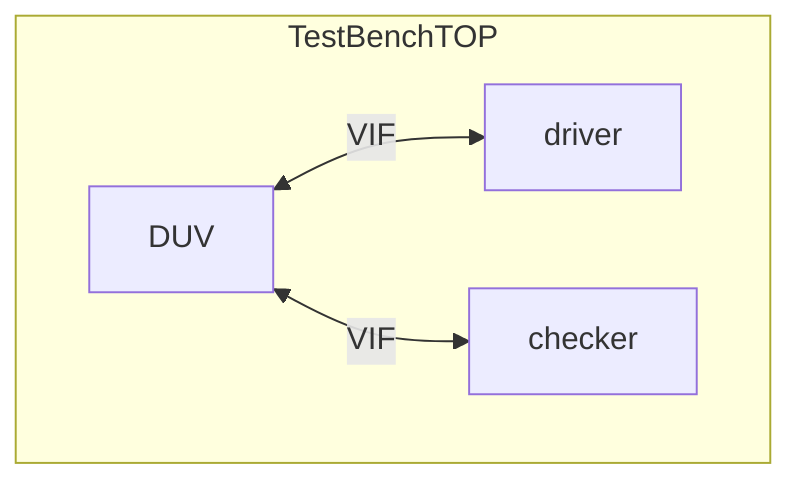

# counter_vif

 Virtual Interface Sample

## DUV

Device Under Test

32bit counter
with enable pin,and asynchronous reset pin

## Test Bench

the structure of Test Bench is

The DUV and Test class are connected by Virtual Interface

driver class drives DUV
checker class judges DUV output vs expected value

## class

### driver: counter_test_driver

class counter_test_driver has task....

- reset_test
  reset DUV
- run_test
   enable DUV counter enable pin
  
### checker: counter_test_checker

class counter_test_driver has task...

- check_count

  judge counter value vs expected value

##  How to run

  execute make command
